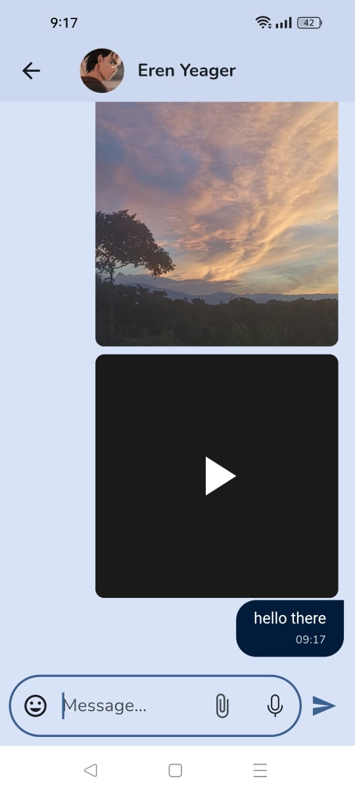

# ChitChat - A Minimal Chat App in Flutter

ChitChat is a simple and elegant chat application built using Flutter. The app allows users to authenticate using their phone number and send real-time messages, including text, images, audio, video, and files, utilizing Firebase as the backend.

## Features

- **Phone Number Authentication**: Users can sign in using their phone number.
- **Real-time Messaging**: Send and receive text messages in real-time.
- **Multimedia Support**: Share images, audio, video, and files.
- **Firebase Integration**: Uses Firebase for real-time database, authentication, and storage.
- **Dynamic Theming**: Automatically adapts to the user's device theme (light or dark mode).
- **Modular Architecture**: Built with `get_it` for dependency injection, ensuring a clean and scalable codebase.
- **Smooth Navigation**: Structured navigation using the `get_it` service locator.

## Getting Started

### Prerequisites

- [Flutter](https://flutter.dev) (>= 3.0.0)
- [Firebase CLI](https://firebase.google.com/docs/cli) for Firebase integration
- An IDE like [Visual Studio Code](https://code.visualstudio.com/) or [Android Studio](https://developer.android.com/studio)

### Setup

1. **Clone the Repository**
    ```bash
    git clone https://github.com/yourusername/chitchat.git
    cd chitchat
    ```

2. **Install Dependencies**
    ```bash
    flutter pub get
    ```

3. **Set Up Firebase**

   - Create a Firebase project in the [Firebase Console](https://console.firebase.google.com/).
   - Add your Android and iOS app to the Firebase project.
   - Follow the setup instructions to add the `google-services.json` (for Android) and `GoogleService-Info.plist` (for iOS) files to your Flutter project.
   - Enable Phone Authentication and Firestore in your Firebase project.
   - Add Firebase Storage to handle file uploads.

4. **Configure Environment**
    - Make sure to add the Firebase configuration files to the respective directories:
        - Android: `android/app/google-services.json`
        - iOS: `ios/Runner/GoogleService-Info.plist`

5. **Run the App**
    ```bash
    flutter run
    ```

## Project Structure

- **`lib/main.dart`**: Entry point of the application.
- **`lib/services/`**: Contains service files (e.g., AuthenticationService, ChatService).
- **`lib/screens/`**: Contains different screen files for various app pages.
- **`lib/models/`**: Data models for the app (e.g., User, Message).
- **`lib/utils/`**: Helper utilities, constants, and shared functions.

## Packages Used

- [firebase_auth](https://pub.dev/packages/firebase_auth) - For phone number authentication.
- [cloud_firestore](https://pub.dev/packages/cloud_firestore) - For real-time data storage.
- [firebase_storage](https://pub.dev/packages/firebase_storage) - For storing media files.
- [get_it](https://pub.dev/packages/get_it) - For dependency injection and service locator.
- [image_picker](https://pub.dev/packages/image_picker) - For selecting images and videos from the gallery or camera.
- [flutter_sound](https://pub.dev/packages/flutter_sound) - For recording and playing audio.
- [file_picker](https://pub.dev/packages/file_picker) - For selecting different file types.
- [intl](https://pub.dev/packages/intl) - For date and time formatting.

## Note on State Management

This project serves as a minimal example to get started with Flutter and Firebase for building chat applications. As you become more familiar with Flutter, consider learning and implementing state management solutions like `Provider`, `Riverpod`, or `Bloc` to enhance the app's scalability and maintainability.(because i learnt i need it)

## Screenshots


## Contributing

Contributions are welcome! Please follow these steps:

1. Fork the repository.
2. Create a new branch (`git checkout -b feature/YourFeature`).
3. Make your changes.
4. Commit your changes (`git commit -m 'Add some feature'`).
5. Push to the branch (`git push origin feature/YourFeature`).
6. Open a pull request.

## License

This project is licensed under the MIT License - see the [LICENSE](LICENSE) file for details.

## Contact

For more information or inquiries, please contact me at iamsushantkhadka754@gmail.com.

---

Happy Coding!
